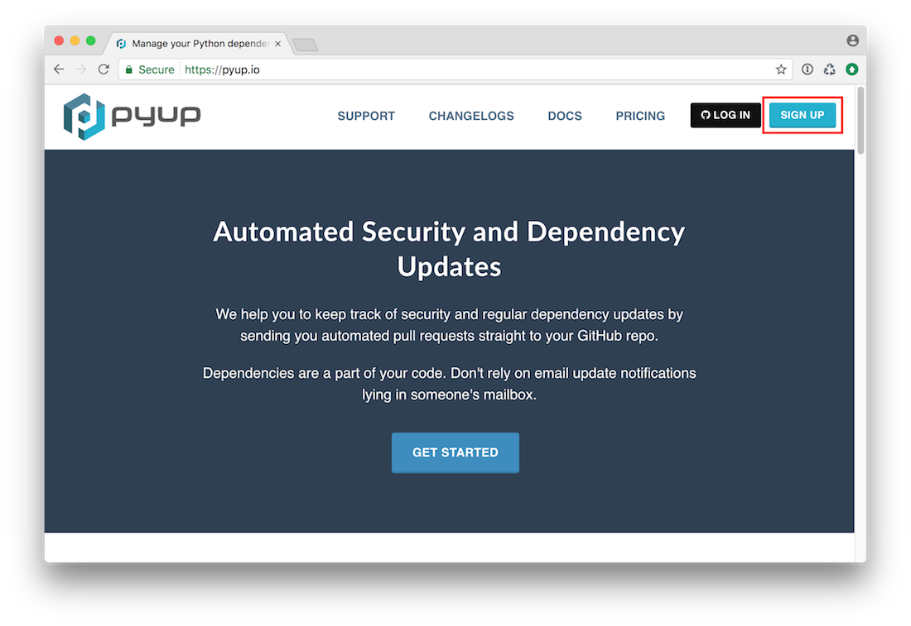
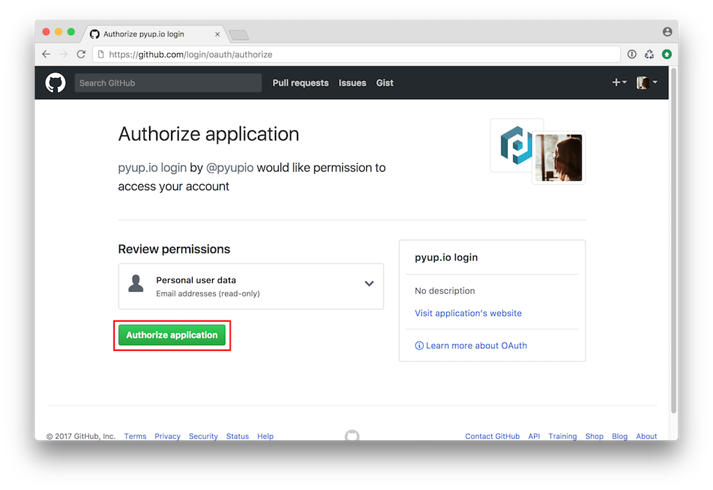
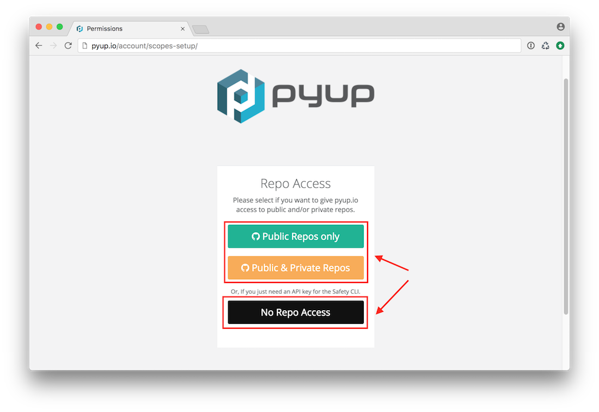
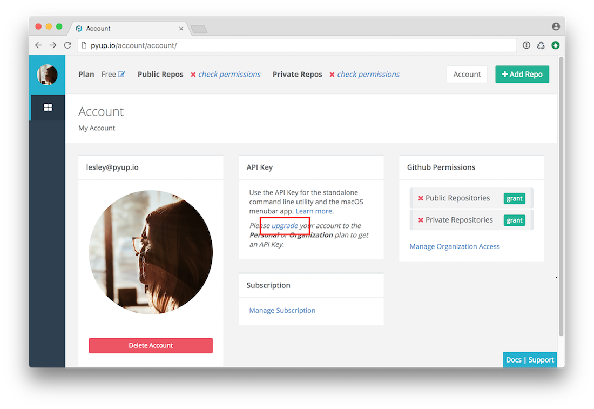
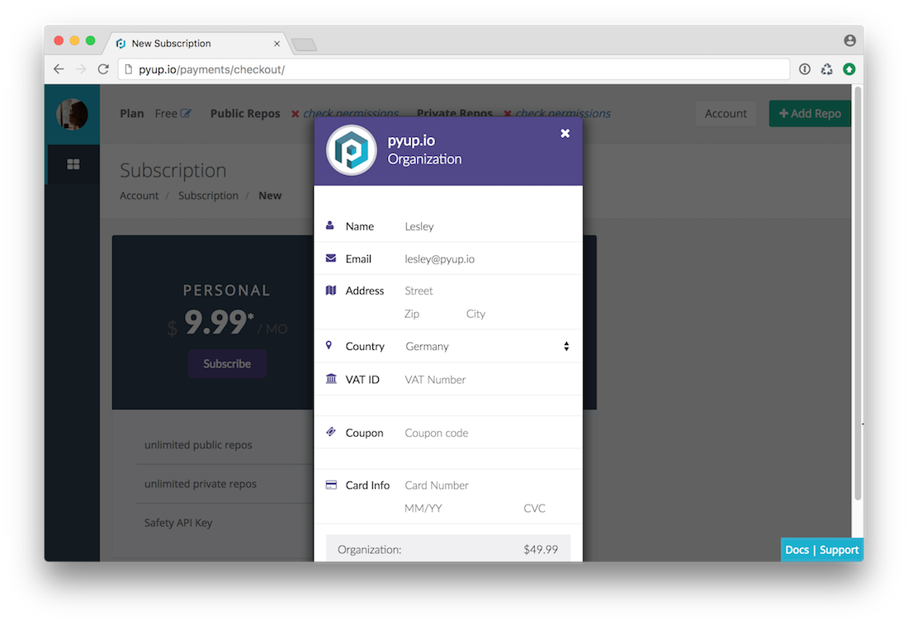
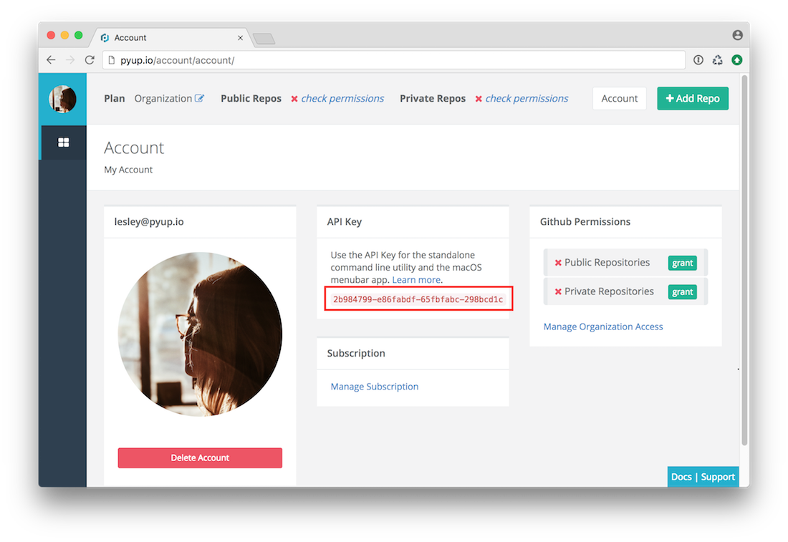

# API Key

This is a step by step guide on how to get an API key that can be used for safety. Using an API Key
with safety gives you access to the latest vulnerabilities. The freely available database
is synced only once per month.

In order to get an API Key you need a monthly subscription on [pyup.io](https://pyup.io), starting at $14.99
for individuals or $49.99 for organizations.

## Step 1 - Sign Up

Go to [pyup.io](https://pyup.io) and click on `sign up`.
 

## Step 2 - Authorize 

You will be redirected to a page on GitHub asking you for permissions to log into pyup.io with your
 GitHub account. Click on `Authorize application`.

## Step 3 - Select Permissions

Select the permissions you want to give pyup.io over your GitHub account. If you just want to obtain
an API Key, click on `No Repo Access`.

## Step 4 - Go to subscriptions

You will be redirected to the account page. In order to get an API Key, you need to subscribe to the Personal
or Organization plan. To do this, click on `upgrade`.

## Step 5 - Subscribe

Select the appropiate plan by clicking on the `Subscribe` button. A modal will pop up. Fill in your
payment details and click on `Pay`. 

## Step 6 - Go back to account page

Once payment is complete, you'll be redirected to your subscriptions page. Click on `Account` to get
back to your account page.

## Step 7 - Copy your API key

Copy your API Key - done.

